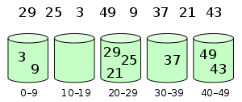

# Linear Sorting Algorithms


## Introduction

- Bucket Sort: divide the input into buckets and sort each bucket individually, or recursively sort each bucket, and then merge the buckets in sorted order, or use a bucket data structure that supports efficient merging (e.g. a priority queue)
- Counting Sort: counting the number of occurrences of each value, and using those counts to compute an array of the number of values smaller than each value, and then using that information to place the values in order
- Radix Sort: sorting by individual digits, starting at the least significant digit, using any stable sorting algorithm for the digit sort


## Comparison

| Algorithm      | Best   | Average | Worst  | Space | Stable ? | In-Place ? |
| -------------- | ------ | ------- | ------ | ----- | -------- | ---------- |
| Bucket Sort    | O(n+k) | O(n+k)  | O(n^2) | O(n)  | Yes      | No         |
| Counting Sort  | O(n+k) | O(n+k)  | O(n+k) | O(k)  | Yes      | No         |
| Radix Sort     | O(nk)  | O(nk)   | O(nk)  | O(n+k)| Yes      | No         |

## Implementation

### Bucket Sort



```js title="Bucket Sort" showLineNumbers
/**
 * Bucket Sort Implementation
 * 
 * Bucket sort is a comparison sort algorithm that operates on elements by
 * dividing them into different buckets and then sorting these buckets
 * individually. Each bucket is sorted individually using a separate sorting
 * algorithm or by applying the bucket sort algorithm recursively. Bucket sort
 * is mainly useful when the input is uniformly distributed over a range.
 * 
 * @see https://en.wikipedia.org/wiki/Bucket_sort
 * 
 * Time Complexity of Solution:
 * Best Case O(n+k); Average Case O(n+k); Worst Case O(n^2),
 * 
 * Space Complexity of Solution:
 * Worst Case O(n).

 * where n is the size of the input array and k means the values range from 0
 * 
 * Stability of Solution: Yes
 * In-Place of Solution: No
 * 
 * @param {number []} list the array of numbers to be sorted.
 * @param {number} size the size of the bucket, default is 5.
 * @return {number []} the sorted array in non-decreasing order.
 */
const bucketSort = (list, size) => {
  if (size === undefined) {
    size = 5;
  }
  if (list.length <= 1) {
    return list;
  }

  const min = Math.min(...list);
  const max = Math.max(...list);

  const bucketCount = Math.floor((max - min) / size) + 1;

  const buckets = new Array(bucketCount).fill().map(() => []);

  list.forEach(num => {
    const key = Math.floor((num - min) / size);
    buckets[key].push(num);
  })

  let sortedList = [];

  for (let i = 0; i < buckets.length; i++) {
    const sortedBucket = buckets[i].sort((a, b) => a - b);
    sortedList = sortedList.concat(sortedBucket);
  }

  return sortedList;
}

export default bucketSort;
```

### Counting Sort

```js title="Counting Sort" showLineNumbers
/**
 * Counting Sort Implementation
 * 
 * Counting sort is a sorting technique based on keys between a specific range.
 * It works by counting the number of objects having distinct key values (kind
 * of hashing). Then doing some arithmetic to calculate the position of each
 * object in the output sequence.
 * 
 * @see https://en.wikipedia.org/wiki/Counting_sort
 * 
 * Time Complexity of Solution:
 * Best Case O(n+k); Average Case O(n+k); Worst Case O(n+k),
 * 
 * Space Complexity of Solution:
 * Worst Case O(n+k).
 *
 * where n is the size of the input array and k means the values range from 0
 * to k.
 * 
 * Stability of Solution: Yes
 * In-Place of Solution: No
 * 
 * @param {number []} nums the array of numbers to be sorted.
 * @return {number []} the sorted array in non-decreasing order.
 *
 */

const countingSort = (nums) => {
  if (nums.length <= 1) {
    return nums;
  }

  const min = Math.min(...nums);
  const max = Math.max(...nums);

  const count = new Array(max - min + 1).fill(0);

  for (let i = 0; i < nums.length; i++) {
    const index = nums[i] - min;
    count[index]++;
  }

  let sortedList = [];
  for (let i = 0; i < count.length; i++) {
    while (count[i] > 0) {
      sortedList.push(i + min);
      count[i]--;
    }
  }

  return sortedList;
}

export default countingSort;
```

### Radix Sort


```js title="Radix Sort" showLineNumbers
/**
 * Radix Sort Implementation
 * 
 * Radix sort is a non-comparative integer sorting algorithm that sorts data with
 * integer keys by grouping keys by the individual digits which share the same
 * significant position and value. A positional notation is required, but because
 * integers can represent strings of characters (e.g., names or dates) and
 * specially formatted floating point numbers, radix sort is not limited to
 * integers.
 * 
 * @see https://en.wikipedia.org/wiki/Radix_sort
 * 
 * @ Time Complexity of Solution:
 * Best Case O(nk); Average Case O(nk); Worst Case O(nk),
 * 
 * @ Space Complexity of Solution:
 * Worst Case O(n+k).
 * 
 * where n is the size of the input array and k means the values range from 0
 * to k.
 * 
 * Stability of Solution: Yes
 * In-Place of Solution: No
 * 
 * 
 */

const radixSort = (items, RADIX) => {
  if (items.length <= 1) {
    return items;
  }
  
  if (RADIX === undefined) {
    RADIX = 10;
  }

  let maxLength = false;
  let placement = 1;

  while (!maxLength) {
    maxLength = true;
    let buckets = [];

    for (let i = 0; i < RADIX; i++) {
      buckets.push([]);
    }

    for (let i = 0; i < items.length; i++) {
      let tmp = items[i] / placement;
      buckets[Math.floor(tmp % RADIX)].push(items[i]);
      if (maxLength && tmp > 0) {
        maxLength = false;
      }
    }

    let idx = 0;
    for (let i = 0; i < RADIX; i++) {
      let bucket = buckets[i];
      for (let j = 0; j < bucket.length; j++) {
        items[idx++] = bucket[j];
      }
    }

    placement *= RADIX;
  }

  return items;
}
```


## Conclusion

Bucket sort, counting sort, and radix sort are sorting algorithms with distinct areas of usefulness. Bucket sort is effective when the input is uniformly distributed across a range, while counting sort excels when the input falls within a small range. Radix sort is advantageous when the input consists of elements with the same number of digits. These algorithms are not affected by the lower bound of O(n log n) imposed on comparison-based sorting algorithms since they do not rely on comparisons. However, they do require additional space as they are not in-place algorithms. Furthermore, these sorting methods are stable, ensuring the relative order of equal elements is preserved. Due to their linear time complexity, they outperform comparison-based sorting algorithms. Nonetheless, their integer-based nature makes them unsuitable for sorting floating-point numbers. Additionally, these algorithms are not adaptive, meaning they cannot leverage existing order within the input. Lastly, they are not online algorithms and cannot sort a list as it is received incrementally.
